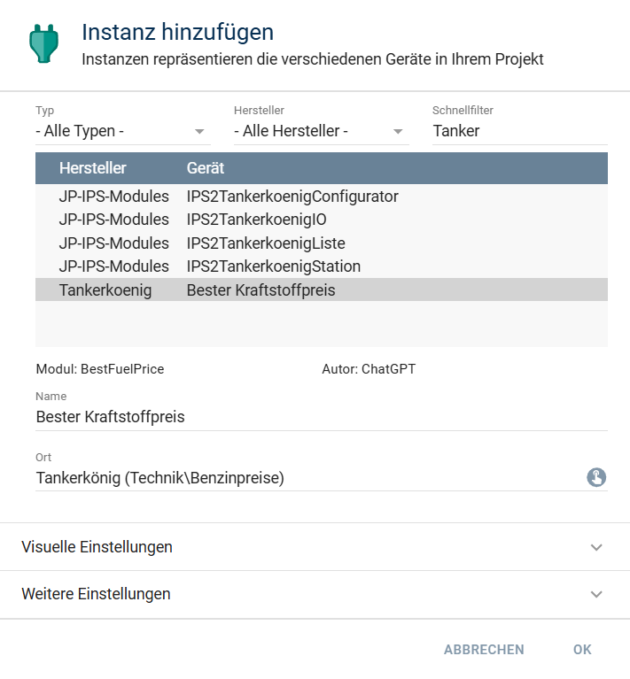
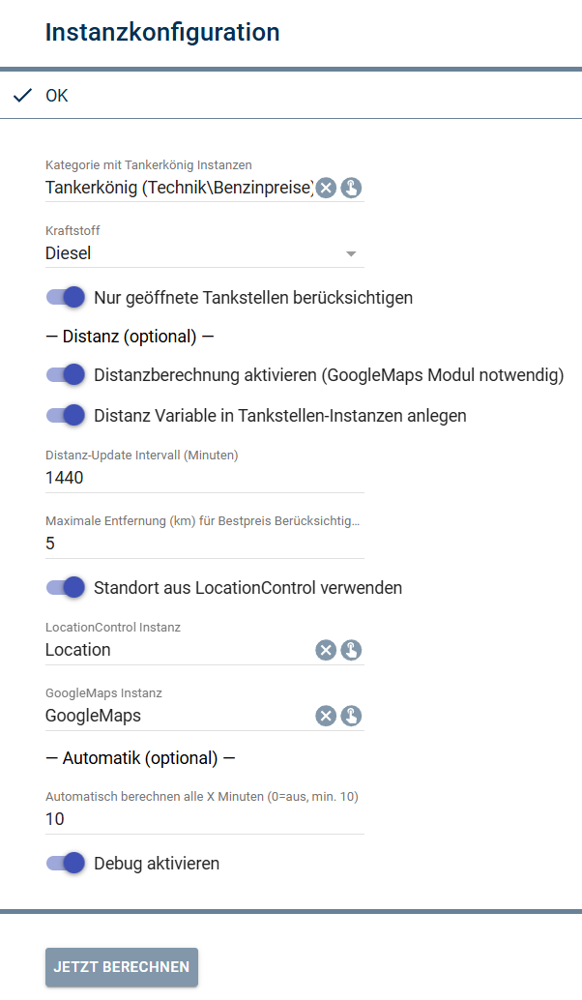
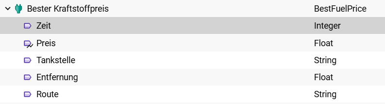

  

# Symcon-Modul: Tankerkoenig Best Price

Dieses Repository stellt ein **Erweiterungs-Modul** für **IPS2Tankerkoenig** bereit.  
Es berechnet den **besten Kraftstoffpreis** (Diesel/E5/E10) über alle konfigurierten Tankstellen, berücksichtigt auf Wunsch nur **geöffnete** Stationen und kann optional **Distanz** sowie **Route** über Google Maps ermitteln.

> Hinweis: Die eigentliche Tankerkönig-Anbindung (API, Aktualisierung der Stationen, Preisvariablen usw.) stammt aus dem Projekt **IPS2Tankerkoenig** von **Joey-1970**. Dieses Modul baut darauf auf und ergänzt ausschließlich die „Best-Price“-Auswertung.

---

## Inhaltsverzeichnis

- 1. Funktionsumfang
- 2. Voraussetzungen
- 3. Software-Installation
- 4. Einrichten der Instanzen in IP-Symcon
- 5. Anhang  
  - 1. GUID der Module  
  - 2. Changelog  
  - 3. Danksagung / Abhängigkeiten  
  - 4. Spenden  
- 6. Lizenz

---

## 1. Funktionsumfang

Folgende Funktionen werden bereitgestellt:

- Auswahl der Kraftstoffart über Dropdown (**Diesel**, **E5**, **E10**)
- Ermittlung des **besten Preises** über alle Tankstellen-Instanzen (aus einer Kategorie)
- Optional: Einschränkung auf **geöffnete** Tankstellen (`State == 1`)
- Bei **Preisgleichheit** gewinnt die **nächste** Tankstelle (Distanz erforderlich)
- Optional: Distanzberechnung über **IPSymconGoogleMaps** (DistanceMatrix)
- Optional: Distanz in den Tankstellen-Instanzen als Variable `DistanceKm` speichern/aktualisieren
- Route zur Tankstelle als **HTML iFrame** (Google Maps Embedded)

📌 Modul enthalten in diesem Repository:

- [BestFuelPrice](./BestFuelPrice) – „Bester Kraftstoffpreis“

---

## 2. Voraussetzungen

- IP-Symcon **6.0 oder höher**
- Installiertes Basis-Modul **IPS2Tankerkoenig** von **Joey-1970** [GITHUB](https://github.com/Joey-1970/IPS2Tankerkoenig)  
  (Dieses Modul liest die dort angelegten Tankstellen-Instanzen aus. )
- Für Distanz/Route: **IPSymconGoogleMaps** von **demel42** (im Symcon Store verfügbar)
- Tankstellen-Instanzen (aus IPS2Tankerkoenig) müssen mindestens folgende Variablen besitzen:
  - `Diesel` / `E5` / `E10` (Preis als Float; Ident entspricht der Kraftstoffart)
  - `State` (Integer; `1` = geöffnet)
  - `petrolStation` (HTML; enthält Straße + Ort – wird für die Route ausgewertet)  
    *(Fallback unterstützt: `PetrolStation`)*

---

## 3. Software-Installation

### Installation über GitHub

1. IP-Symcon Console öffnen  
2. **Kernel → Module Control**
3. Repository hinzufügen (URL anpassen):
   - `https://github.com/TheEldar/TankerkoenigBestPrice`

### Installation über Module-Store

Aktuell (noch) nicht im Module-Store.  
Sobald verfügbar, steht hier ein Hinweis.

---

## 4. Einrichten der Instanzen in IP-Symcon

### 4.1 Instanz hinzufügen

Erstelle eine Instanz vom Typ **„Bester Kraftstoffpreis“**.

### 4.2 Konfiguration

Wichtige Einstellungen:

- **Kategorie mit Tankerkönig Instanzen**  
  Kategorie, unter der die IPS2Tankerkoenig-Tankstellen-Instanzen liegen.
- **Kraftstoff** (Diesel/E5/E10)
- **Nur geöffnete Tankstellen berücksichtigen** (`State == 1`)
- **Debug-Ausgaben aktivieren** (SendDebug; hilfreich bei Fehlersuche)

Optional (nur sichtbar, wenn aktiv):

- **Distanzberechnung aktivieren**
- **Distanz-Update Intervall (Minuten)**  
  (Wie oft `DistanceKm` in den Tankstellen-Instanzen aktualisiert wird.)
- **Maximale Entfernung (km) für Bestpreis**  
  (Stationen außerhalb werden ignoriert.)
- **Standortquelle**  
  - LocationControl (Property `Location` enthält JSON mit `latitude/longitude`) **oder**
  - Eigener Standort (SelectLocation)
- **GoogleMaps Instanz** (IPSymconGoogleMaps)

### 4.3 Ausgabevariablen

In der Modul-Instanz werden folgende Variablen angelegt:

- **Zeit** (`BestTime`, ~UnixTimestamp)
- **Preis** (`BestPrice`, archiviert)
- **Tankstelle** (`BestStation`)
- **Entfernung** (`BestDistance`)
- **Route** (`BestRoute`, HTML iFrame)

### 4.4 Ausführung / Aktualisierung

- Über Button **„Jetzt berechnen“** im Konfigurationsformular
- Per Skript/Funktion:
  - `BFP_Update(<InstanceID>);`
- Optional: Automatik-Intervall (Minuten)  
  (0 = aus, Mindestwert 10 Minuten)

---

## 5. Anhang

### 5.1 GUID der Module

| Modul | Typ | Prefix | GUID |
|------|-----|--------|------|
| Library | Library | – | {8F03A9DA-9E39-4C7C-9D25-78A02A82C9B1} |
| BestFuelPrice | Device | BFP | {D6E94E58-7B69-4D8C-A010-4AFA5A4FA9A6} |

### 5.2 Changelog

Version 1.0:
- Erstes Release (Best-Price Berechnung inkl. optionaler Distanz/Route)

### 5.3 Danksagung / Abhängigkeiten

- **IPS2Tankerkoenig** von **Joey-1970** ([Basis-Modul](https://github.com/Joey-1970/IPS2Tankerkoenig); dieses Projekt ist eine Erweiterung)  
- **IPSymconGoogleMaps** von **demel42** (Distanzmatrix + Embedded Map)

### 5.4 Credits / Spenden / Hinweise

Dieses Projekt ist ein Community-Modul und steht in keiner offiziellen Verbindung zu Tankerkönig.

Die Library ist für die nicht kommerzielle Nutzung kostenlos. Kleine Dankeschöns als Unterstützung für den Autor werden hier akzeptiert:

 

---

## 6. Lizenz

CC BY-NC-SA 4.0 (siehe [LICENSE](./LICENSE))
